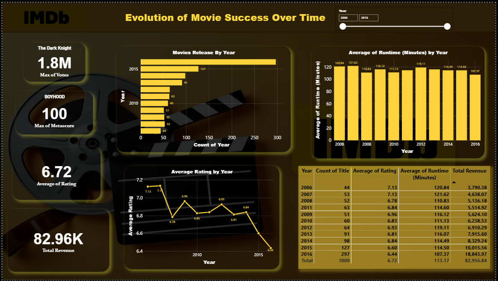
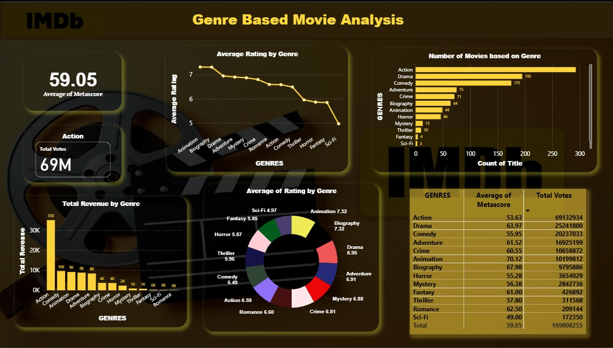
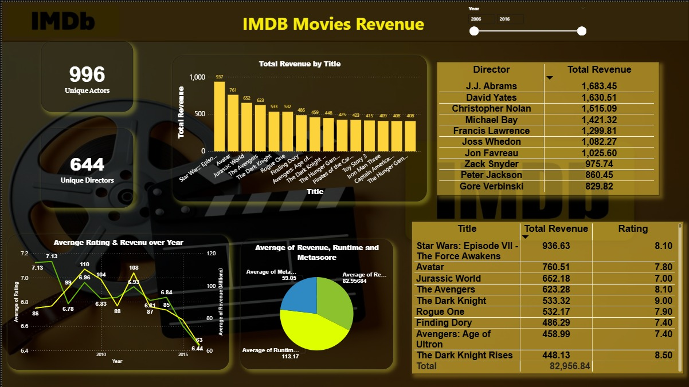

# 🎬 IMDB Movie Sales Analysis | Power BI Project

This Power BI project analyzes IMDb movie data to uncover insights on **box office performance**, **audience ratings**, and **genre trends** over multiple years.
It was developed as part of the **Power BI Training Program at Innomatics Research Labs**.
---

## 📊 Project Overview
This Power BI project analyzes IMDb movie data to uncover trends in movie releases, audience ratings, runtime patterns, and revenue performance across multiple years. 
Through interactive visualizations, it highlights top-rated movies, high-grossing genres, influential directors, and year-wise changes in movie success metrics. 
The dashboard provides a comprehensive view of how factors like genre, ratings, votes, and metascores contribute to overall box office performance.

### 🔍 Key Questions:
- How many movies were released each year?
- Which genres generate the highest total revenue and receive the most audience votes?
- Which directors contribute the most to box office revenue?
- Which movies stand out in terms of total revenue and IMDb ratings?
- How do IMDb ratings, metascores, and runtime influence movie success?
- What are the year-by-year trends in average ratings, runtime, and revenue?
- Which genres have the highest average ratings and metascores?
- How do voting patterns vary across genres and top-rated movies?

---

## 📂 Repository Contents

| File / Folder | Description |
|----------------|-------------|
| `Dashboard/IMDB_Movie_Analysis.pbix` | Power BI project file |
| `[data/IMDB-Movie-Data.csv]` | Dataset used in the Dashboard |
| `[Screenshort/IMDB_ScreenShorts]` | ScreenShorts of Dashboard |
| `[README.md]` | Documentation file |

---

## 🧠 Insights & Findings

- 📅 2016 recorded the highest number of movie releases, showing a peak in production during the period.
- 🎭 Action and Drama emerged as the top revenue-generating genres, also receiving the highest total votes from audiences.
- 🎬 J.J. Abrams, David Yates, and Christopher Nolan stand out as the highest-earning directors based on total box office revenue.
- 💰 Movies with higher IMDb ratings, metascores, and vote counts consistently show stronger revenue performance, indicating a clear positive correlation.
- 📊 Average ratings and runtimes remain relatively stable over the years, with slight variations but no major deviations.
- ⭐ The overall average metascore across all genres is 59.05, reflecting generally favorable critical reviews.
- 🏆 Top-performing movies like Star Wars: The Force Awakens, Avatar, and The Dark Knight significantly influence yearly revenue spikes.

---

## 🧩 Dashboard Metrics

| Metric | Value |
|---------|-------|
| 🎥 Total Movies | 1,000 |
| 💰 Total Revenue | \$82.96 Million |
| ⭐ Average IMDb Rating | 6.8 |
| ⏱️ Average Runtime | 113 Minutes |
| 🎭 Top Genres | Action, Drama, Comedy |
| 🎬 Top Directors | J.J. Abrams, David Yates, and Christopher Nolan  |

---

## 📷 Dashboard Preview

| Page | Preview |
|------|---------|
| Dashboard |  |
| Genre Based |  |
| Movie Revenue|  |

---

## 🛠️ Tools & Technologies

- **Power BI Desktop** – Data modeling, DAX measures, and visualization  
- **Microsoft Excel / CSV** – Data cleaning and preprocessing  
- **GitHub** – Version control and portfolio presentation  
- **IMDb Dataset** – Source data for analysis  

---

## 🚀 How to Use

1. Clone or download this repository.  
2. Open the `.pbix` file in **Power BI Desktop**.  
3. If prompted, connect to the dataset: `data/IMDB-Movie-Data.csv`.  
4. Explore the interactive dashboard and insights.

---

## 🧠 Learnings & Highlights

- Created a full business-friendly navigation layout with custom buttons
- Built over 20+ visuals including KPIs, bar charts, and tables
- Enhanced storytelling with interactivity, conditional formatting, and color-coded KPIs
- Applied real-world best practices in dashboard design and layout

---

## 🧾 Project Details

| Detail | Information |
|---------|-------------|
| 👨‍💻 Author |  Bolla Sai Durga Siva Manikanta  |
| 🏫 Institution | Innomatics Research Labs |
| 📅 Completion | November 2025 |
| 🗂️ Dataset Source | IMDb Movies Dataset |
| 🧭 Category | Data Analysis / Visualization |

---

## ⭐ Acknowledgment

This project was developed under the mentorship of **Innomatics Research Labs**, applying real-world Power BI concepts such as data modeling, relationships, DAX measures, and visualization design.

---

### 💬 Connect With Me
📧 Email: [bollanani542@.com]  
🔗 LinkedIn: [https://www.linkedin.com/in/bollasaidurgasivamanikanta/]  
🐙 GitHub: [https://github.com/Manikanta986]

---

> “Data is powerful — but storytelling with data is what makes it meaningful.” 📈
